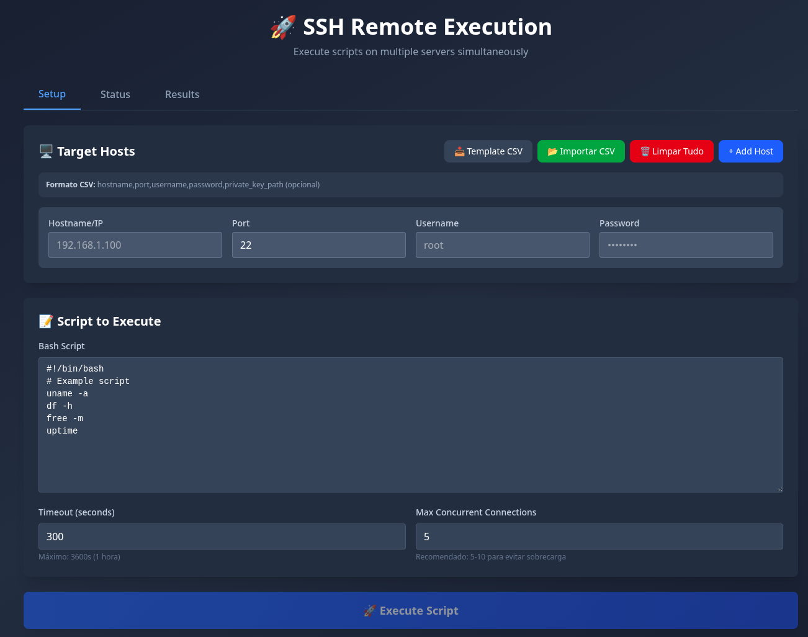
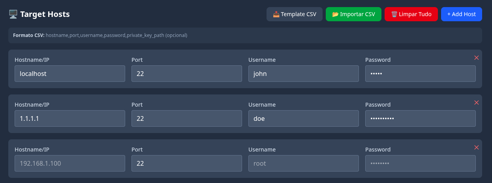
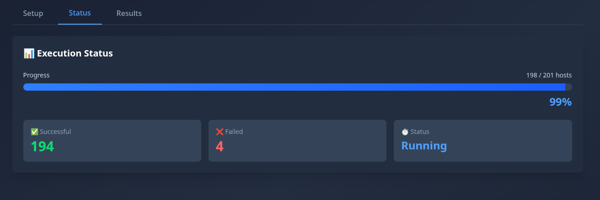
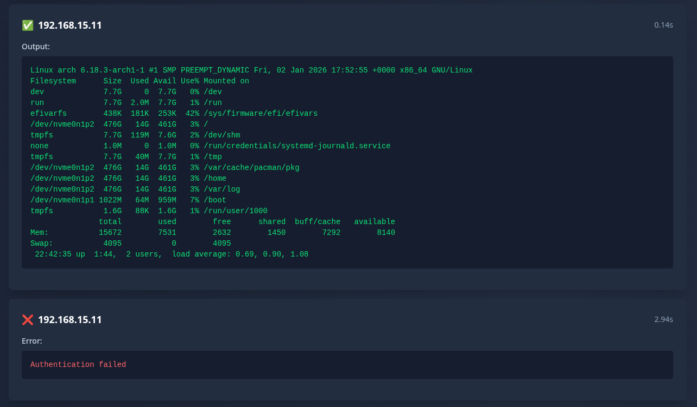
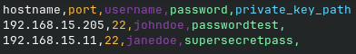
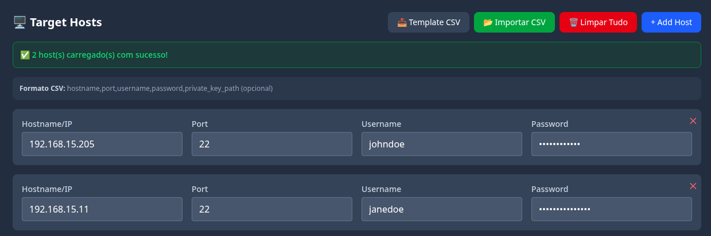

# 🚀 SSH Remote Execution - Orchestrator

Execute scripts em múltiplos servidores SSH simultaneamente com interface web moderna e monitoramento em tempo real.




---

## 📋 Índice

- [Sobre o Projeto](#sobre-o-projeto)
- [Funcionalidades](#funcionalidades)
- [Screenshots](#screenshots)
- [Tecnologias](#tecnologias)
- [Arquitetura](#arquitetura)
- [Instalação](#instalação)
- [Uso](#uso)
- [Desenvolvimento](#desenvolvimento)
- [Docker](#docker)
- [API](#api)
- [Contribuindo](#contribuindo)
- [Licença](#licença)

---

## 🎯 Sobre o Projeto

O SSH Remote Execution é uma ferramenta web que permite executar scripts bash em múltiplos servidores simultaneamente através de conexões SSH. Ideal para:

- 🔄 Deploy automatizado em múltiplos servidores
- 🔍 Coleta de informações de infraestrutura
- 🛠️ Manutenção e atualização em lote
- 📊 Monitoramento e auditoria de servidores
- ⚡ Execução de comandos ad-hoc em massa

<!-- 📸 ADICIONE AQUI: GIF mostrando execução de script -->
<!--  -->

---

## ✨ Funcionalidades

### Interface Web
- ✅ **Gerenciamento de Hosts**: Adicione hosts manualmente ou via CSV
- ✅ **Editor de Scripts**: Editor integrado para scripts bash
- ✅ **Execução Concorrente**: Configure o número de conexões simultâneas
- ✅ **Monitoramento Real-Time**: Acompanhe o progresso da execução
- ✅ **Visualização de Resultados**: Output e erros organizados por host
- ✅ **Import/Export CSV**: Template CSV para facilitar configuração

### Backend
- ✅ **API RESTful**: FastAPI com documentação automática
- ✅ **Execução Assíncrona**: Processamento não-bloqueante
- ✅ **Controle de Timeout**: Timeout configurável por execução
- ✅ **Logging Estruturado**: Logs detalhados para debug
- ✅ **Health Checks**: Endpoints de monitoramento

### DevOps
- ✅ **Docker Ready**: Containerização completa
- ✅ **Multi-stage Builds**: Imagens otimizadas
- ✅ **Nginx**: Servidor web de produção
- ✅ **Health Checks**: Monitoramento de containers

---

## 📸 Screenshots

### Interface Principal

*Interface de configuração de hosts e scripts*

### Configuração de Hosts

*Adicione hosts manualmente ou importe via CSV*

### Editor de Scripts

*Editor de scripts*

### Monitoramento de Execução

*Acompanhe o progresso em tempo real com barra de progresso*

### Resultados

*Visualize output e erros de cada servidor*

### Import CSV.


*Importe múltiplos hosts de uma vez*

---

## 🛠️ Tecnologias

### Frontend
- **Vue 3** - Framework JavaScript progressivo
- **TypeScript** - Tipagem estática
- **Vite** - Build tool moderna e rápida
- **Tailwind CSS** - Framework CSS utility-first
- **Axios** - Cliente HTTP

### Backend
- **FastAPI** - Framework web moderno para Python
- **Paramiko** - Biblioteca SSH para Python
- **Asyncio** - Programação assíncrona
- **Uvicorn** - Servidor ASGI

### DevOps
- **Docker** - Containerização
- **Docker Compose** - Orquestração de containers
- **Nginx** - Servidor web e proxy reverso

---

## 🏗️ Arquitetura

```
┌─────────────────────────────────────────────────────────────┐
│                         Frontend (Vue 3)                     │
│  ┌──────────────┐  ┌──────────────┐  ┌──────────────┐      │
│  │   Setup      │  │   Status     │  │   Results    │      │
│  │   Hosts +    │  │   Real-time  │  │   Output +   │      │
│  │   Scripts    │  │   Progress   │  │   Errors     │      │
│  └──────────────┘  └──────────────┘  └──────────────┘      │
│         │                  │                  │              │
└─────────┼──────────────────┼──────────────────┼──────────────┘
          │                  │                  │
          └──────────────────┼──────────────────┘
                             │
                    ┌────────▼─────────┐
                    │   Nginx (Port    │
                    │   5173 → 80)     │
                    └────────┬─────────┘
                             │
                    ┌────────▼─────────┐
                    │  FastAPI Backend │
                    │   (Port 8000)    │
                    │                  │
                    │  ┌────────────┐  │
                    │  │  API       │  │
                    │  │  Routes    │  │
                    │  └────────────┘  │
                    │  ┌────────────┐  │
                    │  │  Execution │  │
                    │  │  Manager   │  │
                    │  └────────────┘  │
                    └────────┬─────────┘
                             │
          ┌──────────────────┼──────────────────┐
          │                  │                  │
    ┌─────▼─────┐      ┌─────▼─────┐      ┌─────▼─────┐
    │  Server 1 │      │  Server 2 │      │  Server N │
    │    SSH    │      │    SSH    │      │    SSH    │
    └───────────┘      └───────────┘      └───────────┘
```

### Estrutura de Diretórios

```
.
├── backend/                 # Backend FastAPI
│   ├── app/
│   │   ├── api/            # Rotas da API
│   │   ├── core/           # Configurações
│   │   ├── models/         # Modelos de dados
│   │   └── services/       # Lógica de negócio
│   ├── Dockerfile
│   └── requirements.txt
│
├── frontend/               # Frontend Vue 3
│   ├── src/
│   │   ├── components/    # Componentes Vue
│   │   ├── composables/   # Composition API
│   │   ├── services/      # Serviços de API
│   │   ├── types/         # Tipos TypeScript
│   │   ├── utils/         # Utilitários
│   │   └── App.vue
│   ├── Dockerfile
│   ├── nginx.conf
│   └── package.json
│
├── docs/
│   └── screenshots/
│
├── docker-compose.yml
└── README.md
```

---

## 🚀 Instalação

### Pré-requisitos

- Docker 24.0+
- Docker Compose 2.0+
- Node.js 22+ (para desenvolvimento local)
- Python 3.13+ (para desenvolvimento local)

### Instalação com Docker (Recomendado)

```bash
# 1. Clone o repositório
git clone https://github.com/seu-usuario/ssh-orchestrator.git
cd ssh-orchestrator

# 2. Suba os containers
docker-compose up -d --build

# 3. Acesse a aplicação
# Frontend: http://localhost:80
# API: http://localhost:8000
# API Docs: http://localhost:8000/docs
```

### Instalação Local (Desenvolvimento)

#### Backend

```bash
cd backend

# Criar ambiente virtual
python -m venv venv
source venv/bin/activate  # Linux/Mac
# ou
venv\Scripts\activate  # Windows

# Instalar dependências
pip install -r requirements.txt

# Executar
python3 main.py
```

#### Frontend

```bash
cd frontend

# Instalar dependências
npm install

# Executar modo desenvolvimento
npm run dev

# Build para produção
npm run build
```

---

## 💻 Uso

### 1️⃣ Adicionar Hosts

**Opção A: Manualmente**
1. Clique em "Add Host"
2. Preencha: Hostname/IP, Porta, Usuário, Senha
3. Adicione quantos hosts precisar

**Opção B: Import CSV**
1. Clique em "📥 Template CSV" para baixar o modelo
2. Preencha o CSV com seus servidores
3. Clique em "📂 Importar CSV"

**Formato do CSV:**
```csv
hostname,port,username,password,private_key_path
192.168.1.100,22,admin,senha123,
server.example.com,22,root,senha456,/path/to/key
10.0.0.50,2222,ubuntu,senha789,
```

### 2️⃣ Configurar Script

```bash
#!/bin/bash
# Exemplo: Coleta de informações do sistema
echo "=== System Info ==="
uname -a
echo ""
echo "=== Disk Usage ==="
df -h
echo ""
echo "=== Memory ==="
free -m
echo ""
echo "=== Uptime ==="
uptime
```

### 3️⃣ Configurar Execução

- **Timeout**: Tempo máximo em segundos (padrão: 300s)
- **Max Concurrent**: Número de conexões simultâneas (recomendado: 5-10)

### 4️⃣ Executar

1. Clique em "🚀 Execute Script"
2. Acompanhe o progresso na aba "Status"
3. Veja os resultados na aba "Results"

---

## 🔧 Desenvolvimento

### Estrutura do Frontend

```typescript
// Composables - Lógica reutilizável
const { executeScript, executionStatus } = useScriptExecution()

// Services - Comunicação com API
await sshApi.executeScript(payload)

// Utils - Funções auxiliares
const hosts = csvToHosts(parseCSV(csvText))

// Components - UI modular
<HostsConfiguration v-model="hosts" />
<ScriptConfiguration :script="script" />
<ExecutionStatus :status="executionStatus" />
<ExecutionResults :results="results" />
```

### API Endpoints

```
POST   /api/ssh/execute           # Executar script
GET    /api/ssh/status/{id}       # Status da execução
GET    /api/ssh/results/{id}      # Resultados da execução
GET    /health                    # Health check
GET    /docs                      # Documentação Swagger
```

### Scripts Úteis

```bash
# Frontend
npm run dev           # Desenvolvimento
npm run build         # Build produção
npm run preview       # Preview da build

# Docker
docker-compose up -d              # Subir containers
docker-compose down               # Parar containers
docker-compose logs -f            # Ver logs
docker-compose build --no-cache   # Rebuild limpo

# Limpeza
docker-compose down -v            # Remove volumes
docker system prune -a            # Limpa cache Docker
```

---

## 🐳 Docker

### Variáveis de Ambiente

**Backend (docker-compose.yml)**
```yaml
environment:
  - HOST=0.0.0.0
  - PORT=8000
  - LOG_LEVEL=info  # debug, info, warning, error
```

**Frontend (.env)**
```bash
VITE_API_URL=http://localhost:8000
```

### Portas

| Serviço  | Porta | URL                      |
|----------|-------|--------------------------|
| Frontend | 5173  | http://localhost:5173    |
| Backend  | 8000  | http://localhost:8000    |
| API Docs | 8000  | http://localhost:8000/docs |

### Health Checks

```bash
# Frontend
curl http://localhost:5173/health

# Backend
curl http://localhost:8000/health
```

### Comandos Docker

```bash
# Ver logs
docker-compose logs -f frontend
docker-compose logs -f api

# Acessar container
docker-compose exec frontend sh
docker-compose exec api bash

# Rebuild específico
docker-compose build frontend
docker-compose up -d frontend

# Ver recursos
docker stats
```

---

## 📝 Licença

Este projeto está sob a licença MIT. Veja o arquivo [LICENSE](LICENSE) para mais detalhes.

---

## 👥 Autores

- **Rafael Toledo** - *Trabalho Inicial* - [rt-00](https://github.com/rt-00)